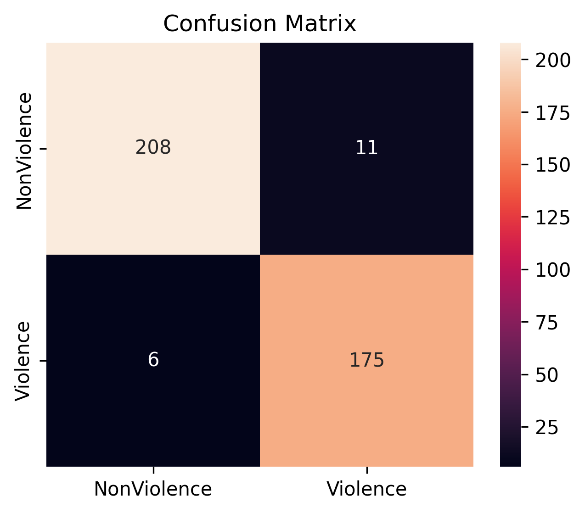

# Violence Detection in Videos

Binary video classifier (Violence / NonViolence) built with PyTorch + EfficientNet-B0.

## Architecture

| Component | Detail |
|---|---|
| Backbone | EfficientNet-B0 (ImageNet pretrained) |
| Temporal pooling | Mean pooling over uniformly sampled frames |
| Classifier head | Linear(1280→256)->ReLU->Linear(256->2) |
| Output format | `.safetensors` |

**Frame sampling:** 16 frames per video sampled uniformly across the clip.

## Training strategy

1. **Warmup phase (epochs 1–4):** backbone frozen, only classifier head trained (lr=3e-4)
2. **Fine-tune phase (epochs 5–15):** full network unfrozen (lr=3e-5), cosine annealing

**Augmentations:** RandomResizedCrop, RandomHorizontalFlip, ColorJitter

## Results

### Validation Performance
- Accuracy: **95.75%**

### Detailed Metrics

| Class         | Precision | Recall | F1-score | Support |
|---------------|----------|--------|----------|---------|
| NonViolence   | 0.97     | 0.95   | 0.96     | 219     |
| Violence      | 0.94     | 0.97   | 0.95     | 181     |
| **Accuracy**  |          |        | **0.9575** | 400     |

### Confusion Matrix



## Real-world Video Testing

| Video         | Ground Truth | Prediction | Violence Probability |
|--------------|-------------|------------|----------------------|
| fight_video  | Violence    | Violence   | 0.9469               |
| boxing        | Violence    | Violence   | 0.9311               |
| park          | NonViolence | NonViolence| 0.1903               |

## Known Issues

- Some videos in dataset were skipped due to decoding errors (OpenCV/FFmpeg "moov atom not found")
- Temporal modeling is based on mean pooling (no explicit motion modeling)

## Model Insight

The model operates on frame-wise spatial features extracted using EfficientNet-B0.
Temporal information is aggregated using mean pooling over uniformly sampled frames. Training was configured for 15 epochs, but training was stopped early at epoch 6 after convergence.

## Installation

```bash
pip install -r requirements.txt
```

## Training

```bash
python train.py \
  --data_root /path/to/Real_Life_Violence_Dataset \
  --epochs 15 \ # training may stop early if convergence is reached
  --batch_size 8 \
  --num_frames 16
```

## Evaluation on validation set

```bash
python evaluate.py \
  --data_root /path/to/Real_Life_Violence_Dataset \
  --weights models/violence_classifier.safetensors
```

## Inference on a single video

```bash
python predict.py \
  --video /path/to/video.mp4 \
  --weights models/violence_classifier.safetensors
```

Output example:
```json
{
  "prediction": "Violence",
  "confidence": "0.9341",
  "violence_prob": "0.9341",
  "non_violence_prob": "0.0659"
}
```

## Dataset

[Real Life Violence Situations Dataset](https://www.kaggle.com/datasets/mohamedmustafa/real-life-violence-situations-dataset)  
2000 videos (1000 Violence + 1000 NonViolence), split 80/20 train/val.

## Citation

M. Soliman et al., "Violence Recognition from Videos using Deep Learning Techniques",
ICICIS'19, Cairo, pp. 79–84, 2019.
